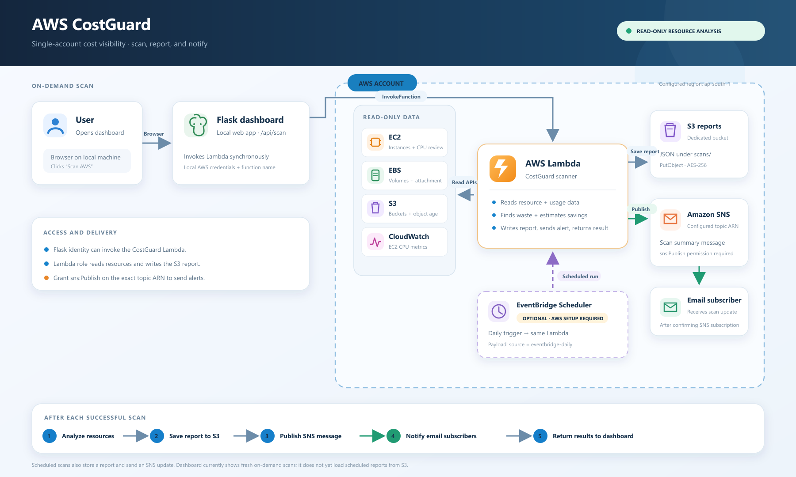
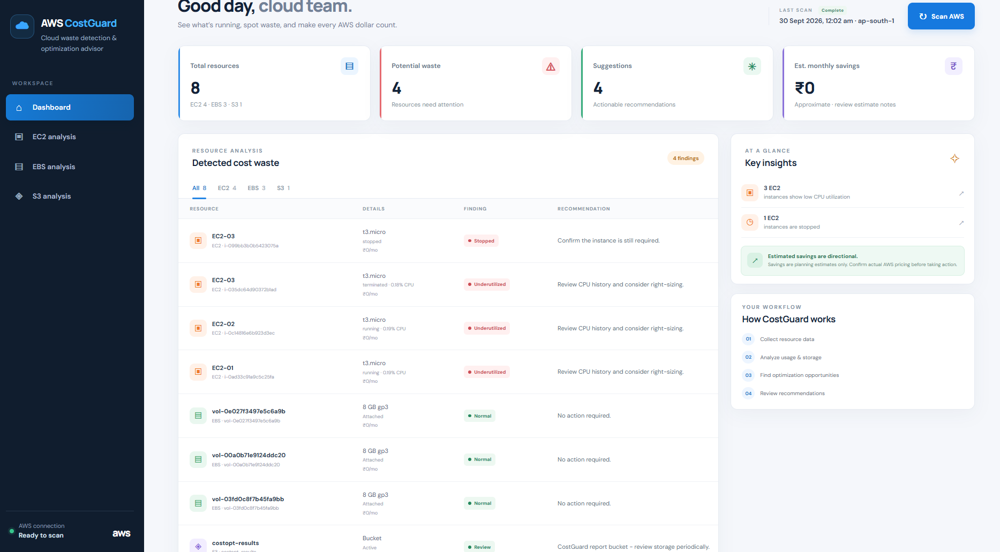
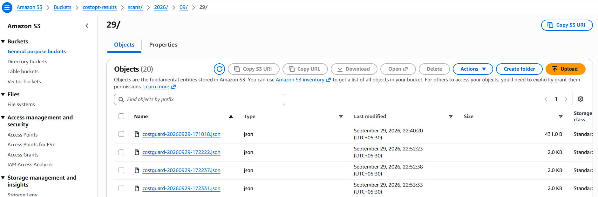
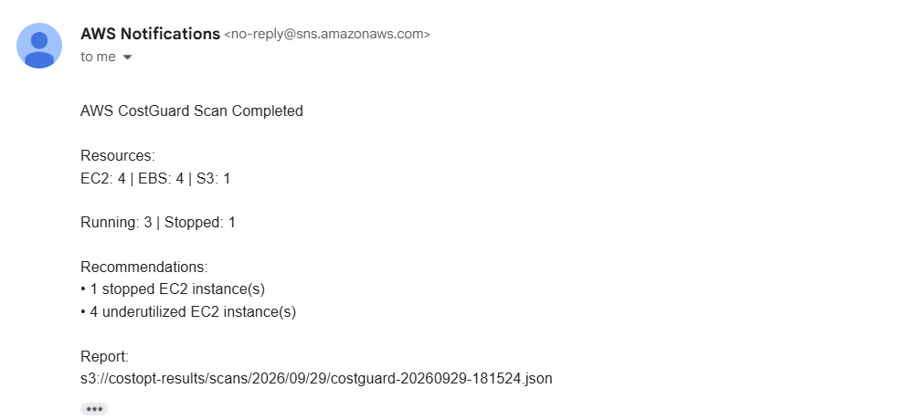
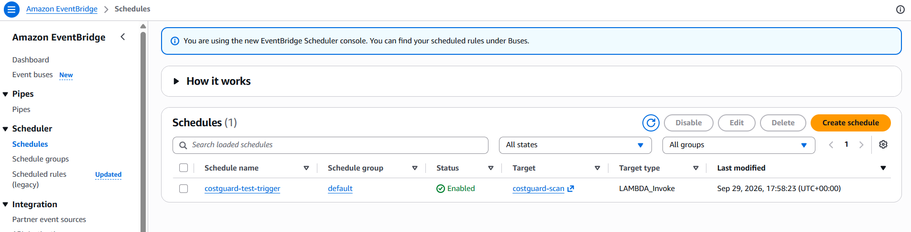
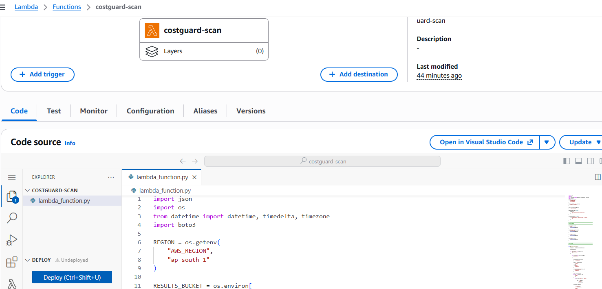

# ☁️ AWS CostGuard – Cloud Cost Monitoring & Optimization

AWS CostGuard is a cloud cost monitoring and optimization project that scans AWS resources, identifies potentially underutilized or unnecessary resources, estimates potential monthly savings, and provides recommendations through a local web dashboard.
The application uses AWS Lambda as the main scanning engine and integrates with Amazon EC2, Amazon EBS, Amazon S3, Amazon CloudWatch, Amazon SNS, and EventBridge Scheduler.

---

## 🎯 Project Objective

The goal of AWS CostGuard is to provide a simple way to monitor AWS resource usage and identify possible areas of cost optimization.

The system:

* Scans EC2 instances and their current state
* Monitors EC2 CPU utilization using CloudWatch
* Reviews EBS volumes and storage usage
* Reviews S3 bucket storage
* Identifies stopped and underutilized resources
* Estimates potential monthly savings
* Stores scan reports in Amazon S3
* Sends scan summaries through Amazon SNS
* Automatically runs scheduled scans using EventBridge Scheduler
* Displays scan results through a Flask dashboard

---

## 🏗️ Architecture




---

## 🛠️ AWS Services & Screenshots

---

| AWS Service | Screenshot |
|-------------|------------|
| **CostGuard Dashboard** |  |
| &nbsp; | &nbsp; |
| **Amazon S3** |  |
| &nbsp; | &nbsp; |
| **Amazon SNS** |  |
| &nbsp; | &nbsp; |
| **EventBridge Scheduler** |  |
| &nbsp; | &nbsp; |
| **AWS Lambda** |  |

---
## ✨ Key Features

* 🔍 **EC2 Resource Scanning**
* 📊 **CPU Utilization Monitoring**
* 💾 **EBS Storage Analysis**
* 🪣 **S3 Storage Review**
* 💰 **Estimated Monthly Savings**
* 💡 **Cost Optimization Recommendations**
* 📄 **Automatic JSON Scan Reports**
* 📧 **SNS Scan Notifications**
* ⏰ **Scheduled Automated Scans**
* 🖥️ **Local Flask Dashboard**

---

## 🛠️ AWS Services Used

| AWS Service           | Purpose                                        |
| --------------------- | ---------------------------------------------- |
| Amazon EC2            | Resources monitored by CostGuard               |
| Amazon EBS            | Storage volume analysis                        |
| AWS Lambda            | Main cost scanning engine                      |
| Amazon CloudWatch     | EC2 CPU utilization monitoring                 |
| Amazon S3             | Stores scan reports and reviews bucket storage |
| Amazon SNS            | Sends scan notifications                       |
| EventBridge Scheduler | Automatically triggers scheduled scans         |
| IAM                   | Controls permissions for AWS resources         |

---

## 💻 Technology Stack

| Category      | Technologies          |
| ------------- | --------------------- |
| Backend       | Python, Flask         |
| AWS SDK       | Boto3                 |
| Frontend      | HTML, CSS, JavaScript |
| Cloud         | AWS                   |
| Monitoring    | Amazon CloudWatch     |
| Notifications | Amazon SNS            |
| Scheduling    | EventBridge Scheduler |

---

## 🔄 System Workflow

1. The user opens the CostGuard Flask dashboard locally.
2. The Flask application invokes the AWS Lambda scanner.
3. Lambda scans EC2 instances and EBS volumes.
4. CloudWatch provides recent EC2 CPU utilization data.
5. Lambda reviews S3 buckets and their stored objects.
6. Potentially stopped or underutilized resources are identified.
7. Potential monthly savings are estimated based on the detected resources.
8. A JSON scan report is stored in Amazon S3.
9. Amazon SNS sends a short scan summary notification.
10. EventBridge Scheduler can trigger the same scanning process automatically.


## 🛠️ Troubleshooting

- **`COSTGUARD_LAMBDA_FUNCTION` error**  
  Set the environment variable in the same terminal before starting Flask.

- **Flask returns `502`**  
  Check the Lambda function name, AWS region, `lambda:InvokeFunction` permission, and Lambda logs.

- **Lambda reports `AccessDenied`**  
  Check the Lambda execution role and verify the required EC2, CloudWatch, S3, and SNS permissions.

- **Scan succeeds but no email arrives**  
  Confirm the SNS email subscription has been confirmed and verify the topic ARN and AWS region.

- **EventBridge scan does not run**  
  Check the schedule state, time zone, target Lambda ARN, and Scheduler role's `lambda:InvokeFunction` permission.


---

## 🚀 Setup & Run

### 1. Clone the Repository

```bash
git clone https://github.com/vijayaawss/AWS-CostGuard.git
cd AWS-Costguard
```

### 2. Create Virtual Environment

```bash
python -m venv venv
```

Activate on Windows:

```bash
venv\Scripts\activate
```

### 3. Install Dependencies

```bash
pip install -r requirements.txt
```

### 4. Configure Lambda Function

Set the Lambda function name:

PowerShell:

```powershell
$env:COSTGUARD_LAMBDA_FUNCTION="costguard-scan"
```

Set AWS region:

```powershell
$env:AWS_REGION="ap-south-1"
```

### 5. Run Flask Application

```bash
python app.py
```

Open:

```text
http://127.0.0.1:5000
```


## 🚀 Future Enhancements

* Cost Explorer integration for actual AWS cost data
* More detailed resource-level cost analysis
* Historical cost trends
* Additional AWS resource checks
* Automated optimization reports
* More advanced cost anomaly detection

---

## 👩‍💻 Author

**Vijaya Sonawane**
AWS | Cloud | Infrastructure | DevOps
